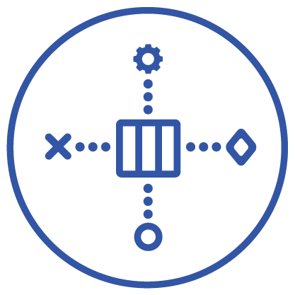

= Chronicle-Logger
:toc: manual
:toc-placement: preamble

image:https://javadoc.io/badge2/net.openhft/chronicle-logger/javadoc.svg[link="https://www.javadoc.io/doc/net.openhft/chronicle-logger/latest/index.html"]

An extremely fast java logger, using https://github.com/OpenHFT/Chronicle-Queue[Chronicle Queue]
as persistence engine. We feel the logging should not slow down your system.

=== Version

[#image-maven]
[caption="", link=https://maven-badges.herokuapp.com/maven-central/net.openhft/chronicle-logger]
image::https://maven-badges.herokuapp.com/maven-central/net.openhft/chronicle-logger/badge.svg[]

== Overview

Today most programs require the logging of large amounts of data, especially in trading systems where this is a 
regulatory requirement. Loggers can affect your system performance, therefore logging is sometimes kept to a minimum.
With Chronicle Logger we aim to minimize logging overhead, freeing your system to focus on the business logic.

Chronicle logger supports most of the standard logging API’s including: 

* <<chronicle-logger-slf4j, SLF4J>>
* <<chronicle-logger-logback, Logback>>
* <<chronicle-logger-log4j-1, Apache log4j 1.2>>
* <<chronicle-logger-log4j-2, Apache log4j 2>>
* <<chronicle-logger-jul, Java Util Logging>>
* <<chronicle-logger-jcl, Apache Common Logging>>

Chronicle Logger is able to aggregate all your logs to a central store. It has built-in resilience, so you will never
lose messages.

At the moment, Chronicle Logger only supports binary logs, which is beneficial for write speed but requires extra tools
to read them. We provide some basic #tools[tools] for that and an API to develop your own.

== How it works

Chronicle Logger is built on top of Chronicle Queue. It provides multiple logging frameworks' adapters and is a low latency,
high throughput synchronous writer. Unlike asynchronous writers, you will always see the last message before
the application dies, as usually it is the last message that is the most valuable.

== Performance

We have run a benchmark to compare Chronicle Logger with normal file appender of Log4J2 (the quickest of mainstream
logging frameworks). Results below:

|===
|*Benchmark*                           |*Mode*|*Samples*|*Score*|*Score error*|*Units*

|Chronicle Logger, simple message        |  avgt  |   5       |784.761  |  68.018       | ns/op
|Chronicle Logger, message with Exception|  avgt  |   5       |12801.245|  417.695      | ns/op
|Log4J2, simple message                  |  avgt  |   5       |2427.177 |  454.057      | ns/op
|Log4J2, message with Exception          |  avgt  |   5       |17173.369|  3193.413     | ns/op
|===

Test Hardware:
[source]
----
Intel Core i7-6700K
32GB DDR4 RAM
512GB M.2 PCI-e 3.0 x 4 NVMe SSD
----

== Bindings

All config files for bindings support limited variable interpolation where the variables are replaced with the 
corresponding values from the same configuration file or the system properties. We have one predefined variable, `pid`,
so `${pid}`  will replaced by current process id. System properties have the precedence in placeholder replacement 
so they can be overriden.

The following can be configured for each logger:

|===
| *Property* | *Description*                          | *Values*                       | *Per-Logger*

| path          | the base directory of a Chronicle        |                                  | yes
| level         | default log level                        | trace, debug, info, warn, error  | yes
|===

Additionally, underlying Chronicle Queue can be tweaked by providing the following optional config properties:

* `bufferCapacity`
* `blockSize`
* `rollCycle`

If set, these will override the default Chronicle Queue configuration. _Use with caution!_

*Please Note*

  * Loggers are not hierarchically grouped so `my.domain.package.MyClass1` and `my.domain` are two distinct entities.
  * The `path` is used to track the underlying Chronicle Queue so having two loggers configured with the same `path` is unsupported

=== chronicle-logger-slf4j

The chronicle-logger-slf4j is an implementation of SLF4J API > 1.7.x.

To configure this sl4j binding you need to specify the location of a properties files (file-system or classpath) 
via system properties:

[source]
----
-Dchronicle.logger.properties=${pathToYourPropertiesFile}
----

Alternatively, you could use one of the default locations: `chronicle-logger.properties` 
or `config/chronicle-logger.properties` located in the classpath.

The default configuration is build using properties with `chronicle.logger.root` as prefix but you can also set 
per-logger settings i.e. `chronicle.logger.L1.*`

==== Config Example

[source, properties]
----
# shared properties
chronicle.base                        = ${java.io.tmpdir}/chronicle-logs/${pid}

# logger : default
chronicle.logger.root.path            = ${slf4j.chronicle.base}/main
chronicle.logger.root.level           = debug

# optional tweaks
chronicle.logger.root.cfg.bufferCapacity = 128
chronicle.logger.root.cfg.blockSize      = 256

# logger : L1
chronicle.logger.L1.path              = ${slf4j.chronicle.base}/L1
chronicle.logger.L1.level             = info
----

=== chronicle-logger-logback

The chronicle-logger-logback module provides appender for Logback: `net.openhft.chronicle.logger.logback.ChronicleAppender`

==== Config Example
  
[source, xml]
----
<appender name  = "ChronicleAppender"
        class = "net.openhft.chronicle.logger.logback.ChronicleAppender">
  
  <!-- Path used by the underlying ChronicleQueue -->
  <path>${java.io.tmpdir}/ChronicleAppender</path>

  <!--
  Configure the underlying ChronicleQueue tweaks
  -->
  <chronicleConfig>
      <blockSize>128</blockSize>
  </chronicleConfig>
</appender>
----

=== chronicle-logger-log4j-1

We provide log4j1 appender `net.openhft.chronicle.logger.log4j1.ChronicleAppender`

==== Config Example

[source, xml]
----
<!DOCTYPE log4j:configuration SYSTEM "log4j.dtd">
<log4j:configuration xmlns:log4j='http://jakarta.apache.org/log4j/'>

    <!-- ******************************************************************* -->
    <!--                                                                     -->
    <!-- ******************************************************************* -->

    <appender name  = "CHRONICLE"
              class = "net.openhft.chronicle.logger.log4j1.ChronicleAppender">
        <param name="path" value="${java.io.tmpdir}/chronicle-log4j1/chronicle"/>
    </appender>

    <!-- ******************************************************************* -->
    <!-- STDOUT                                                              -->
    <!-- ******************************************************************* -->

    <appender name  = "STDOUT"
              class = "org.apache.log4j.ConsoleAppender">
        <layout class="org.apache.log4j.PatternLayout">
            <param name="ConversionPattern" value="%-4r [%t] %-5p %c %x - %m%n" />
        </layout>
    </appender>

    <!-- ******************************************************************* -->
    <!--                                                                     -->
    <!-- ******************************************************************* -->

    <logger name="chronicle" additivity="false">
        <level value="trace"/>
        <appender-ref ref="CHRONICLE"/>
    </logger>

    <!-- ******************************************************************* -->
    <!--                                                                     -->
    <!-- ******************************************************************* -->

    <logger name="net.openhft" additivity="false">
        <level value="warn"/>
        <appender-ref ref="STDOUT"/>
    </logger>

    <!-- ******************************************************************* -->
    <!--                                                                     -->
    <!-- ******************************************************************* -->

    <root>
        <level value="debug" />
        <appender-ref ref="STDOUT" />
    </root>

</log4j:configuration>
----

=== chronicle-logger-log4j-2

Use `<Chronicle/>` element in `<appenders/>` to create Chronicle appender. Optional `<chronicleCfg/>` element can be
used to tweak underlying Chronicle Queue.

==== Config Example

[source, xml]
----
<?xml version="1.0" encoding="UTF-8"?>
<configuration packages="net.openhft.chronicle.logger,net.openhft.chronicle.logger.log4j2">

    <!-- ******************************************************************* -->
    <!-- APPENDERS                                                           -->
    <!-- ******************************************************************* -->

    <appenders>

        <Console name="STDOUT" target="SYSTEM_OUT">
            <PatternLayout pattern="[CHRONOLOGY] [%-5p] %c - %m%n%throwable{none}"/>
        </Console>

        <Chronicle name="CHRONICLE">
            <path>${sys:java.io.tmpdir}/chronicle-log4j2/binary-chronicle</path>
            <chronicleCfg>
                <blockSize>128</blockSize>
                <bufferCapacity>256</bufferCapacity>
            </chronicleCfg>
        </Chronicle>

    </appenders>

    <!-- ******************************************************************* -->
    <!-- LOGGERS                                                             -->
    <!-- ******************************************************************* -->

    <loggers>

        <root level="all">
            <appender-ref ref="STDOUT"/>
        </root>

        <logger name="chronicle" level="trace" additivity="false">
            <appender-ref ref="CHRONICLE"/>
        </logger>

        <!-- *************************************************************** -->
        <!--                                                                 -->
        <!-- *************************************************************** -->

        <logger name="net.openhft" level="warn"/>

    </loggers>

</configuration>
----

=== chronicle-logger-jul

Use `net.openhft.chronicle.logger.jul.ChronicleHandler` as a handler

==== Config Example

[source, properties]
----
handlers=java.util.logging.ConsoleHandler, net.openhft.chronicle.logger.jul.ChronicleHandler

.level=ALL

java.util.logging.ConsoleHandler.level=ALL
java.util.logging.ConsoleHandler.formatter=java.util.logging.SimpleFormatter

net.openhft.level=WARNING
net.openhft.handlers=java.util.logging.ConsoleHandler

net.openhft.chronicle.logger.jul.ChronicleHandler.path = ${java.io.tmpdir}/chronicle-jul
net.openhft.chronicle.logger.jul.ChronicleHandler.level = ALL

chronicle.level=INFO
chronicle.handlers=net.openhft.chronicle.logger.jul.ChronicleHandler
chronicle.useParentHandlers=false
----

=== chronicle-logger-jcl

Similar to slf4j, to configure this binding you need to specify the location of a properties files (file-system or classpath) 
via system properties:
[source]
----
-Dchronicle.logger.properties=${pathToYourPropertiesFile}
----

Alternatively, you could use one of the default locations: `chronicle-logger.properties` 
or `config/chronicle-logger.properties` located in the classpath.

==== Config Example

[source, properties]
----
chronicle.logger.base             = ${java.io.tmpdir}/chronicle-jcl
chronicle.logger.root.path        = ${chronicle.logger.base}/root
chronicle.logger.root.level       = debug

# logger : Logger1
chronicle.logger.logger_1.path    = ${chronicle.logger.base}/logger_1
chronicle.logger.logger_1.level   = info
----

=== Tools

* `net.openhft.chronicle.logger.tools.ChroniCat` - tool to dump log contents to STDOUT
[source]
---
ChroniCat [-w <wireType>] <path>
    <wireType> - wire format, default BINARY_LIGHT
    <path>     - base path of Chronicle Logs storage

mvn exec:java -Dexec.mainClass="net.openhft.chronicle.logger.tools.ChroniCat" -Dexec.args="..."
---

* `net.openhft.chronicle.logger.tools.ChroniTail` - same as ChroniCat but waits for more data, similar to *nix `tail` utility

[source]
----
ChroniTail [-w <wireType>] <path>
    <wireType> - wire format, default BINARY_LIGHT
    <path>     - base path of Chronicle Logs storage

mvn exec:java -Dexec.mainClass="net.openhft.chronicle.logger.tools.ChroniTail" -Dexec.args="..."
----

* We also provide generic interface to interact with logs, `net.openhft.chronicle.logger.tools.ChronicleLogReader`,
allowing arbitrary operations with decoded log lines. Please refer to javadocs.

